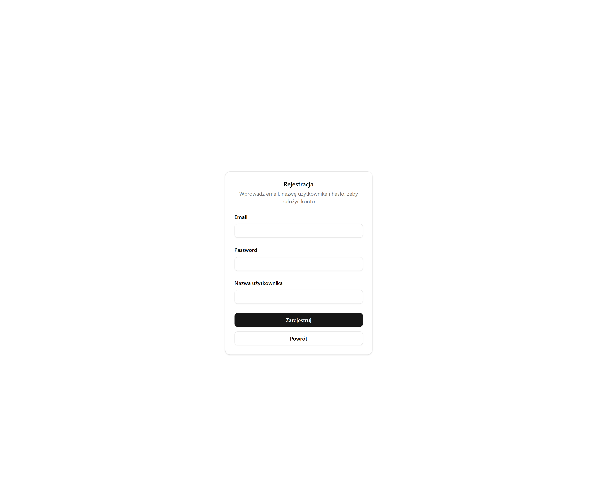
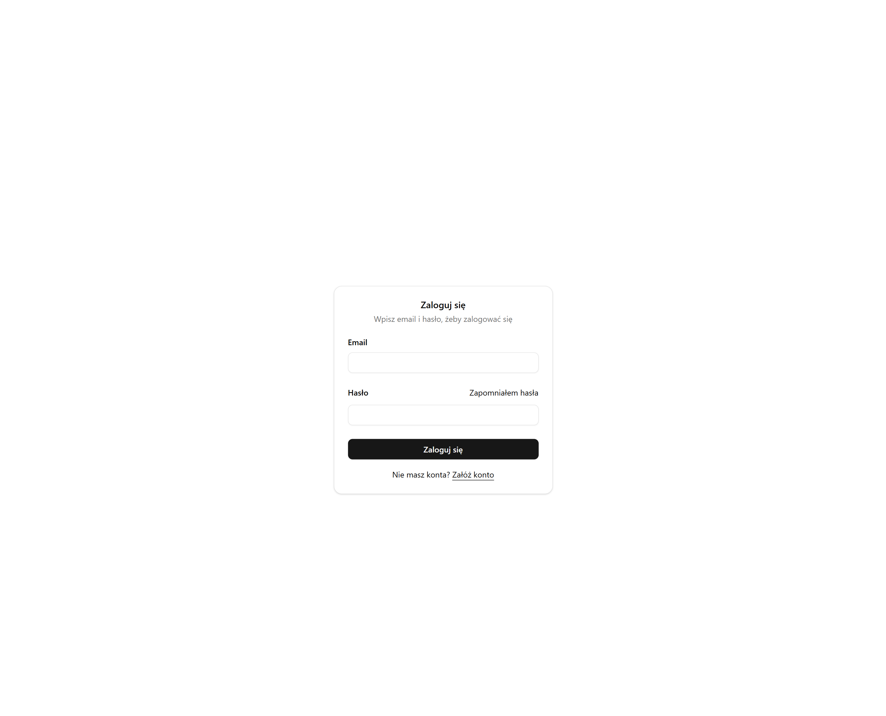
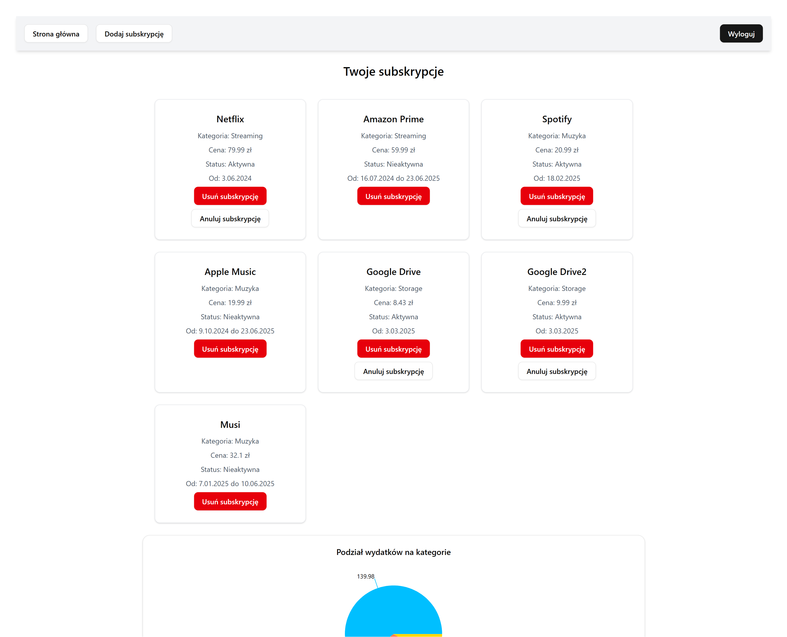
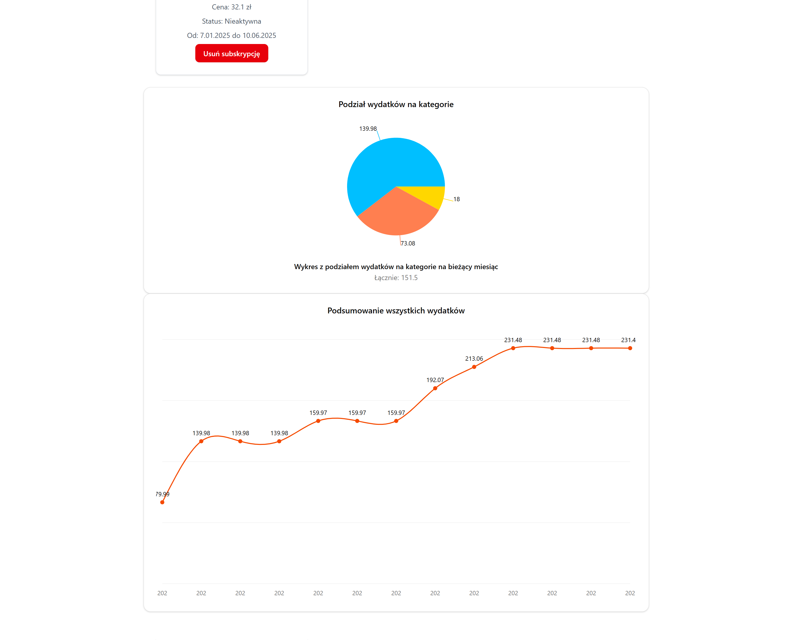
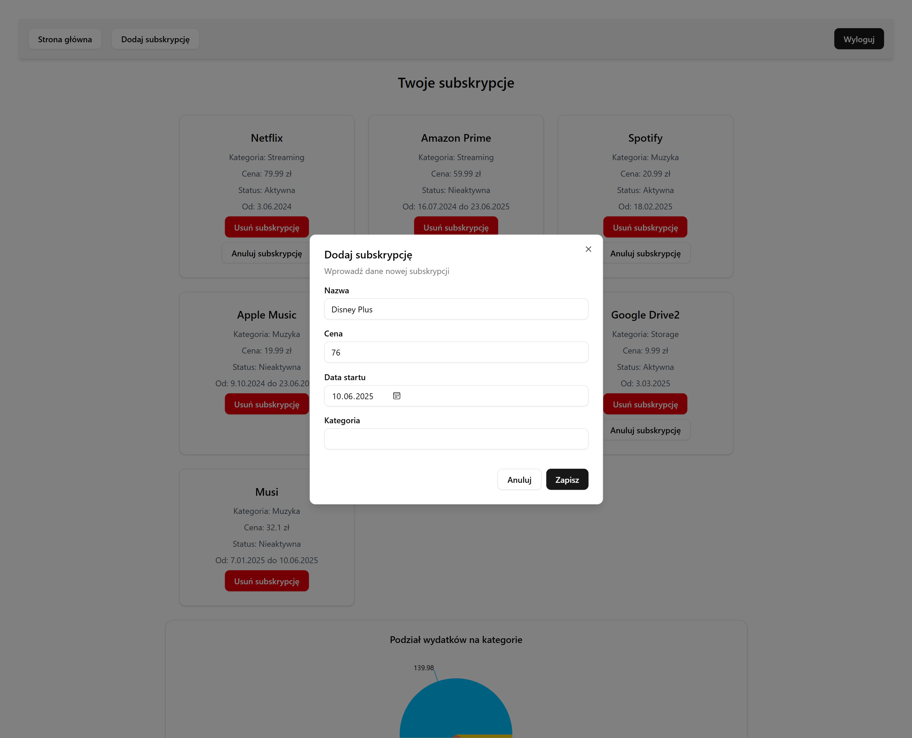
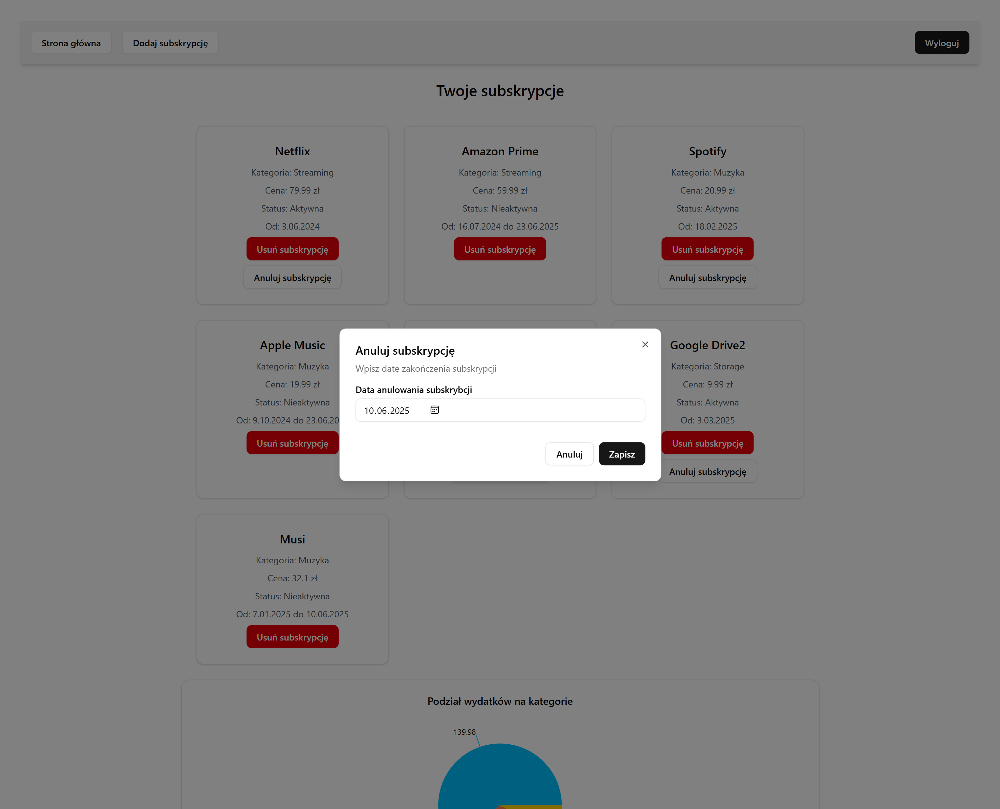

# ```Expenses Tracker```
A full-stack application for managing and tracking recurring subscriptions and monthly expenses.

Users can register and log in using JWT based authentication and add, cancel or delete their expenses.

The system provides monthly summaries of expenses and category-based breakdowns to visualize where money goes.

#### Backend:
- Java 24
- Spring Boot 3.5.0
- Spring Security + JWT Authentication
- MySQL (via Docker)
- Hibernate (JPA)

#### Frontend
- React (Vite + TypeScript)
- TailwindCSS
- React Hook Form + Zod










